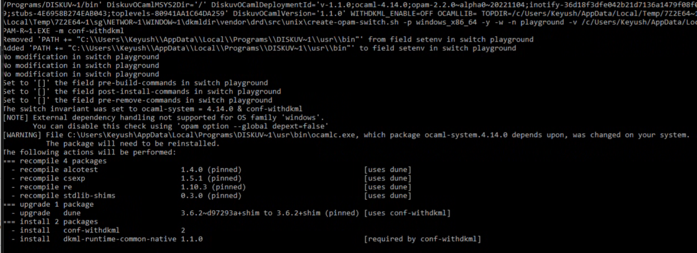

Getting Started with Diskuv OCaml
=================================

.. sidebar:: First time visiting us?

   The `Introduction`_ section is the best place to start!

.. toctree::
   :maxdepth: 2
   :caption: Table of Contents

   self
   doc/BeyondBasics
   doc/SdkProject
   doc/CompilingInDepth
   doc/CommandReference
   doc/Troubleshooting
   doc/OpamIntegration
   doc/Advanced
   doc/FutureExtensions
   doc/Planning/index

Introduction
------------

This section is about getting started with *Diskuv OCaml*. We will begin by giving you a brief overview of
where to learn about OCaml, show you what you will get with the *Diskuv OCaml* distribution, and finish with how to get
the *Diskuv OCaml* distribution installed on your system.

About OCaml
-----------

There are a few webpages that you should have bookmarked as you learn about OCaml. The first is
the official OCaml website's `About OCaml <https://ocaml.org/about>`_ which has a comprehensive list of features
that OCaml provides (the sales pitch!), and a good summary of OCaml:

    OCaml mixes power and pragmatism in a way that makes it ideal for building complex software systems. What
    makes OCaml special is that it occupies a sweet spot in programming language design. It provides a
    combination of efficiency, expressiveness, and practicality that is matched by no other language. That is
    in large part because OCaml is an elegant combination of language features that have been developed over
    the last 40 years.

Then we recommend reading the first five chapters of the online textbook
`OCaml Programming - Correct + Efficient + Beautiful`_. The textbook has
Youtube videos that can be watched independently of the book.
The textbook and the videos will guide you through the language and
explore each of OCaml's major features.

Once you start writing your own code you will need to know where to look to find libraries (called **packages** in
OCaml). We recommend browsing the packages at
`OCaml Packages <https://v3.ocaml.org/packages>`_ since it is official,
reasonably up-to-date and has most package's documentation.

Finally, if you hit a roadblock the best place to go is the `Discord chat rooms <https://tinyurl.com/discord-ocaml>`_
and ask your question on the ``#beginners`` channel:

.. image:: doc/Intro-discord.jpg
  :width: 500
  :alt: Discord Server chat room

|

About Diskuv OCaml
------------------

The Diskuv OCaml distribution is an open-source set of software
that supports software development in pure OCaml. The distribution's
strengths are its:

* full compatibility with OCaml standards like Opam, Dune and ocamlfind
* laser focus on "native" development (desktop software, mobile apps and embedded software) through support for the standard native compilers like Visual Studio
  and Xcode
* ease-of-use through simplified installers and simple productivity commands; high school students should be able to use it
* security through reproducibility, versioning and from-source builds

These alternatives may be better depending on your use case:

* Developing in a Javascript first environment? Have a look at `Esy and Reason <https://esy.sh/>`_
* Developing operating system kernels? Have a look at `Mirage OS <https://mirage.io/>`_
* Developing Linux server software like web servers? Plain old `OCaml on Debian, etc. <https://ocaml.org/docs/up-and-running>`_ works well
* Writing compilers or proofs? Plain old OCaml works really well
* Wanting quick installations? *Use anything but Diskuv OCaml!* Diskuv OCaml will conduct
  from-source builds unless it can guarantee (and code sign) the binaries are
  reproducible. Today that means a lot of compiling.

.. note::

  Diskuv OCaml officially supports Windows **64-bit** machines and will soon
  support macOS machines.

The *Diskuv OCaml* distribution includes the following OCaml components:

- The basic OCaml system including:

  ocamlc
    `The batch compiler <https://ocaml.org/manual/comp.html>`_
  ocaml
    `The toplevel system <https://ocaml.org/manual/toplevel.html>`_ or REPL.
    *We also include a full-featured toplevel; see utop below*
  ocamlrun
    `The runtime system <https://ocaml.org/manual/runtime.html>`_
  ocamlopt
    `The native-code compiler <https://ocaml.org/manual/native.html>`_
  ocamllex, ocamlyacc
    `Lexer and parser generators <https://ocaml.org/manual/lexyacc.html>`_
  ocamldep
    `The dependency generator <https://ocaml.org/manual/depend.html>`_
  ocamldoc
    `The documentation generator <https://ocaml.org/manual/ocamldoc.html>`_
  ocamldebug
    `The debugger <https://ocaml.org/manual/debugger.html>`_
  ocamlprof
    `The profiler <https://ocaml.org/manual/profil.html>`_
  ocamlmklib
    `The mixed C/OCaml library maker <https://ocaml.org/manual/intfc.html>`_
- opam
    `Opam <https://opam.ocaml.org/>`_, the standard package manager for OCaml
- dune
    `Dune <https://dune.readthedocs.io/>`_, the standard build tool for OCaml
- utop
    `UTop <https://github.com/ocaml-community/utop#readme>`_, the standard "toplevel" for interactively running
    OCaml code
- ocamllsp
    `OCaml Language Server <https://github.com/ocaml/ocaml-lsp#ocaml-lsp>`_ for use with
    OCaml friendly IDEs like Visual Studio Code and Emacs
- ocamlformat and ocamlformat-rpc
    `OCamlFormat <https://github.com/ocaml-ppx/ocamlformat#readme>`_, the standard auto-formatter for OCaml code
  ocp-indent
    `ocp-indent <http://www.typerex.org/ocp-indent.html>`_, the standard indenter for mixed OCaml/non-OCaml documents
- findlib
    `Findlib <http://projects.camlcity.org/projects/findlib.html>`_, the standard library manager for OCaml modules
- flexdll
    `FlexDLL <https://github.com/alainfrisch/flexdll#readme>`_ for expert users who are creating dynamic plugins

The *Diskuv OCaml* distribution will automatically install the following components if missing from your system:

- git
    `Git <https://git-scm.com/book/en/v2/Getting-Started-About-Version-Control>`_, the standard version control for
    getting, saving and sharing source code.
- cl, link
    `Visual Studio Build Tools <https://docs.microsoft.com/en-us/visualstudio/install/workload-component-id-vs-build-tools?view=vs-2019#desktop-development-with-c>`_,
    the official Microsoft tools for building modern C/C++ apps for Windows

Sponsor
-------

.. image:: https://ocaml-sf.org/assets/ocsf_logo.svg
  :width: 400
  :alt: OCSF logo

Thanks to the `OCaml Software Foundation <https://ocaml-sf.org>`_
for economic support to the development of Diskuv OCaml.

How to Install
--------------

.. note::

   These instructions are currently only for Windows developers.

Requirements
~~~~~~~~~~~~

- 64-bit Windows 10 or 64-bit Windows 11. *More operating systems will be coming.*
- A fast internet connection. You will be downloading tens of gigabytes of data.
- 30GB of disk space.
- Administrator access on your computer to install the Microsoft C compilers. If you use a shared or restricted PC,
  please ask your PC administrator if they can follow the :ref:`Advanced - Windows Administrator` instructions; after that you
  and others on the PC can install without Administrator access.
- You don't need to watch the installation, but you do need to keep your computer powered on for at least 2 (two)
  hours. The *Diskuv OCaml* installer will be downloading and doing intensive compilation during these hours,
  and you are free to do other things on your computer while it downloads and compiles.

Installation Instructions
~~~~~~~~~~~~~~~~~~~~~~~~~

Briefly review the following:

* Do not use the installer if you have a space in your username
  (ex. ``C:\Users\Jane Smith``).
* You need to **stay at your computer** and press "Yes" for any Windows security popups;
  after the DKML installer finishes with two programs (``Visual Studio Installer``
  and ``Git for Windows``) you can leave your computer for the remaining one and
  a half (1.5) hours.
* First time installations may get a notification printed in red. If you see it, reboot your
  computer and then restart your installation so that Visual Studio Installer
  can complete. The notification looks like:

  .. code-block:: diff

    - FATAL [118acf2a]. The machine needs rebooting.
    - ...
    - >>> The machine needs rebooting. <<<
    -         ...
    -         FATAL [5f927a8b].
    -         A transient failure occurred.
    -         ...
    -         >>> A transient failure occurred. <<<

* You may be asked to accept a certificate from
  ``Open Source Developer, Gerardo Grignoli`` for the ``gsudo`` executable
  that was issued by
  ``Certum Code Signing CA SHA2``.

Then run the `latest Windows 64-bit installer <https://github.com/diskuv/dkml-installer-ocaml/releases/download/v1.1.0/setup-diskuv-ocaml-windows_x86_64-1.1.0.exe>`__.

Any existing opam repositories on your machine will be silently upgraded and may
take tens of minutes to convert. Be patient with the step at:

Install is done! What next?
"""""""""""""""""""""""""""

You have completed the installation of *Diskuv OCaml*. Let us try some of the things you can do right now.

1. Open PowerShell (press the Windows key ⊞, type "PowerShell" and then Open ``Windows PowerShell``).
   Do not re-use an old PowerShell window since it will know nothing about the new installation you just did.
2. Run the ``utop`` application.

   .. code-block:: ps1con

      PS> utop
      > ──────────┬─────────────────────────────────────────────────────────────┬──────────
      >           │ Welcome to utop version 2.9.0 (using OCaml version 4.12.1)! │
      >           └─────────────────────────────────────────────────────────────┘
      >
      > Type #utop_help for help about using utop.
      >
      > ─( 19:03:24 )─< command 0 >─────────────────────────────────────────{ counter: 0 }─
      > utop #

   *You may get some harmless warnings (ex. ``failed to lock file``) that you can safely ignore.*
3. Now let us try to enter some basic OCaml expressions ... be sure to
   include the ``;;`` and then press ENTER after each line:

   .. code-block:: tcshcon

      utop #> 3.5 +. 6. ;;
      > - : float = 9.5
      utop #> 30_000_000 / 300_000 ;;
      > - : int = 100
      utop #> let square x = x * x ;;
      > val square : int -> int = <fun>
      utop #> square 2 ;;
      > - : int = 4
      utop #> square (square 2) ;;
      > - : int = 16

4. You probably want to do a lot more than that! You may want to edit your code in a easy-to-use editor
   with syntax highlighting, type inspection and auto-complete
   (an "integrated development environment" or more simply an **IDE**). You may also want to use other
   people's code packages. Right now if you tried to use the ``Graphics`` package, for example, you will get
   an error:

   .. code-block:: tcshcon

      utop #> open Graphics ;;
      > Error: Unbound module Graphics

5. Leave the ``utop`` application by typing:

   .. code-block:: tcshcon

     utop #> #quit ;;

   *Remember that if you get harmless warnings (ex. ``failed to lock file``) you can safely ignore them.*

6. :ref:`BeyondBasics` is the topic of the next section. **Please starting read it.**

Indices and tables
==================

* :ref:`genindex`
* :ref:`modindex`
* :ref:`search`

.. _OCaml Programming - Correct + Efficient + Beautiful: https://cs3110.github.io/textbook/cover.html
